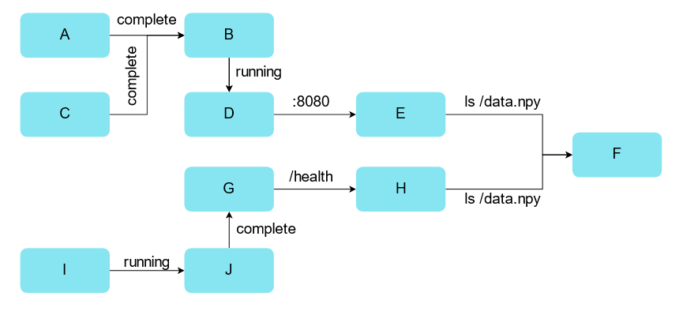
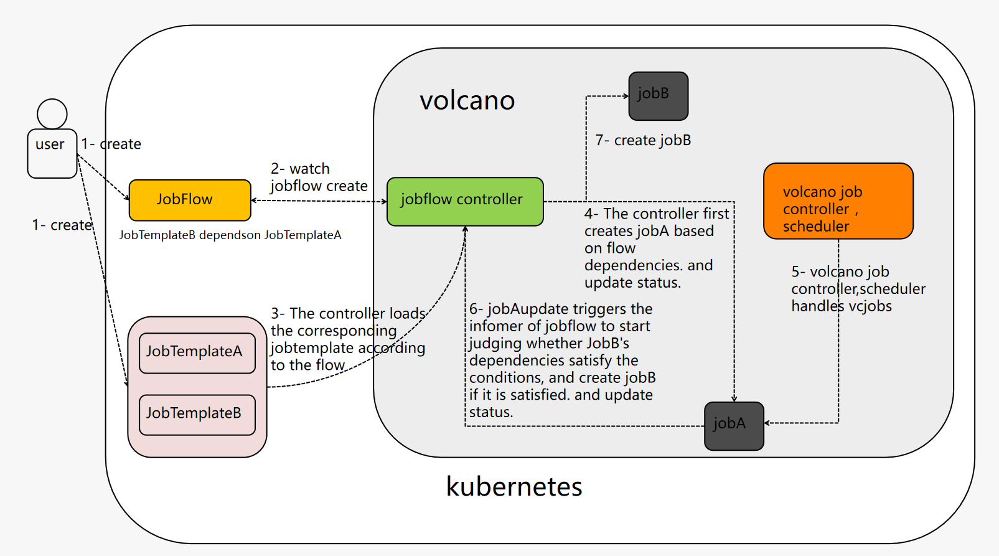
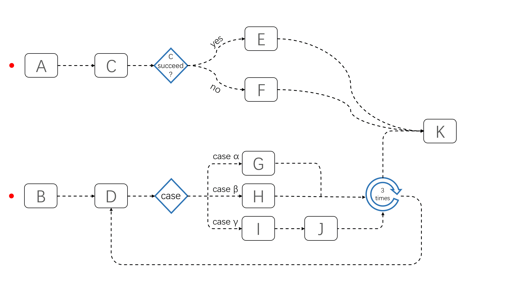

# JobFlow

## Introduction

In order to solve the problem of inter-job dependencies. We need many VCJobs to cooperate each other and orchestrate them manually or by another Job Orchestration Platform to get the job done finally.We present an new way of orchestrating VCJobs called JobFlow. We proposed two concepts to running multiple batch jobs automatically named JobTemplate and JobFlow so end users can easily declare their jobs and run them using complex controlling primitives, for example, sequential or parallel executing, if-then-else statement, switch-case statement, loop executing and so on.

JobFlow helps migrating AI, BigData, HPC workloads to the cloud-native world. Though there are already some workload flow engines, they are not designed for batch job workloads. Those jobs typically have a complex running dependencies and take long time to run, for example days or weeks. JobFlow helps the end users to declare their jobs as an jobTemplate and then reuse them accordingly. Also, JobFlow orchestrating those jobs using complex controlling primitives and launch those jobs automatically. This can significantly reduce the time consumption of an complex job and improve resource utilization. Finally, JobFlow is not an generally purposed workflow engine, it knows the details of VCJobs. End user can have a better understanding of their jobs, for example, job's running state, beginning and ending timestamps, the next jobs to run, pod-failure-ratio and so on.

## Scope

### In Scope
- Start sequence between multiple jobs
- Dependency completion state of the job start sequence
- DAG-based job dependency startup

### Out of Scope
- Supports other job
- Achieve vcjobs level gang

## Scenarios

- Some jobs need to depend on the completion of the previous job or other status when running, etc. Otherwise, the correct result cannot be calculated.
- Sometimes inter-job dependencies also require diverse dependency types, such as conditional dependencies, circular dependencies, probes, and so on.



## Design

### Controller



### Webhook

```
Create a JobFlow check
1、There cannot be a template with the same name in a JobFlow dependency
  Such as: A->B->A->C A appears twice
2、Closed loops cannot occur in JobFlow
  E.g：A -> B  ->  C
          ^     /
          |    /
          < - D

Create a JobTemplte check (following the vcjob parameter specification)
E.g: job minAvailable must be greater than or equal to zero
   job maxRetry must be greater than or equal to zero
   tasks cannot be empty, and cannot have tasks with the same name
   The number of task replicas cannot be less than zero
   task minAvailable cannot be greater than task replicas...
```

### JobFlow

#### Introduction

JobFlow defines the running flow of a set of jobs. Fields in JobFlow define how jobs are orchestrated.

#### Definition

JobFlow mainly has the following fields:

* spec.jobretainpolicy: After JobFlow succeed, keep the generated job. Otherwise, delete it.
* spec.flows.name: Indicates the name of the vcjob.
* spec.flows.dependsOn.targets: Indicates the name of the vcjob that the above vcjob depends on, which can be one or multiple vcjobs
* status.pendingJobs: vcjobs in pending state
* status.runningJobs: vcjobs in running state
* status.failedJobs: vcjobs in failed state
* status.completedJobs: vcjobs in completed state
* status.terminatedJobs: vcjobs in terminated state
* status.unKnowJobs: vcjobs in unKnow state
* status.jobList: Status information of all split vcjobs
* status.conditions: It is used to describe the current state, creation time, completion time and information of all vcjobs. The vcjob state here additionally adds the waiting state to describe the vcjob whose dependencies do not meet the requirements.
* status.state.phase: Status of JobFlow
```
Succeed： All vcjobs have reached completed state。
Terminating： Jobflow is deleting。
Failed： A vcjob in the flow is in the failed state, so the vcjob in the flow cannot continue to be delivered。
Running： Flow contains vcjob in Running state。
Pending: The flow contains no vcjob in the Running state。
```

[the sample file of JobFlow](../../../example/jobflow/JobFlow.yaml)

### JobTemplate

#### Introduction

* JobTemplate is the template of vcjob, after JobTemplate is created, it will not be processed by vc-controller like vcjob, it will wait to be referenced by JobFlow.
* JobFlow can reference multiple jobtemplates
* A jobtemplate can be referenced by multiple jobflows
* JobTemplate can be converted to and from vcjob.

#### Definition

The spec field of JobTemplate is exactly the same as that of vcjob. You can view [the sample file of JobTemplate](../../../example/jobflow/JobTemplate.yaml)

## JobFlow task scheduling



## Demo video

https://www.bilibili.com/video/BV1c44y1Y7FX

## Usage

- Create the jobTemplate that needs to be used
- Create a jobflow. The flow field of the jobflow is filled with the corresponding jobtemplate used to create a vcjob.
- The field jobRetainPolicy indicates whether to delete the vcjob created by the jobflow after the jobflow succeeds. (delete/retain) default is retain.

## JobFlow Features

### Features that have been implemented

* Create JobFlow and JobTemplate CRD
* Support sequential start of vcjob
* Support vcjob to depend on other vcjobs to start
* Support the conversion of vcjob and JobTemplate to each other
* Supports viewing of the running status of JobFlow

### Features not yet implemented

* `if` statements
* `switch` statements
* `for` statements
* Support job failure retry in JobFlow
* Integration with volcano-scheduler
* Support for scheduling plugins at JobFlow level